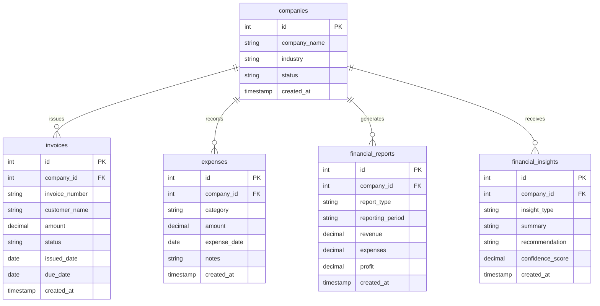

# Entity Relationship Diagram

```mermaid
erDiagram

    companies {
        int id PK
        string company_name
        string industry
        string status
        timestamp created_at
    }

    invoices {
        int id PK
        int company_id FK
        string invoice_number
        string customer_name
        decimal amount
        string status
        date issued_date
        date due_date
        timestamp created_at
    }

    expenses {
        int id PK
        int company_id FK
        string category
        decimal amount
        date expense_date
        string notes
        timestamp created_at
    }

    financial_reports {
        int id PK
        int company_id FK
        string report_type
        string reporting_period
        decimal revenue
        decimal expenses
        decimal profit
        timestamp created_at
    }

    financial_insights {
        int id PK
        int company_id FK
        string insight_type
        string summary
        string recommendation
        decimal confidence_score
        timestamp created_at
    }

    companies ||--o{ invoices : issues
    companies ||--o{ expenses : records
    companies ||--o{ financial_reports : generates
    companies ||--o{ financial_insights : receives
```
